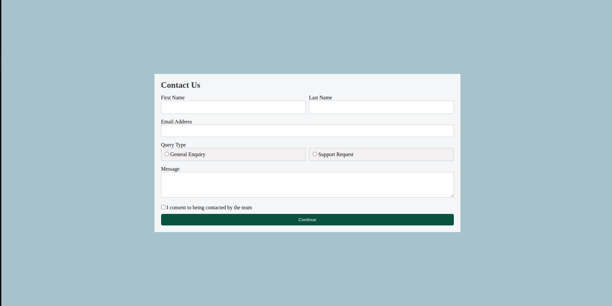

# Contact Form

This is a simple, responsive contact form built using **HTML**, **CSS**, and **JavaScript**.

## 📌 Features

- First name and Last name inputs
- Email input
- Query type radio buttons
- Message textarea
- Consent checkbox
- Submit button with validation
- Responsive layout for small screens

## 🛠 Technologies Used

- HTML5
- CSS3
- JavaScript (Vanilla)

## 💻 How to Use

1. Clone or download the repository.
2. Open `index.html` in your browser.
3. Fill out the form and click "Continue".
4. JS will validate the form and show a success or error message.

## 📷 Screenshot

 
 
